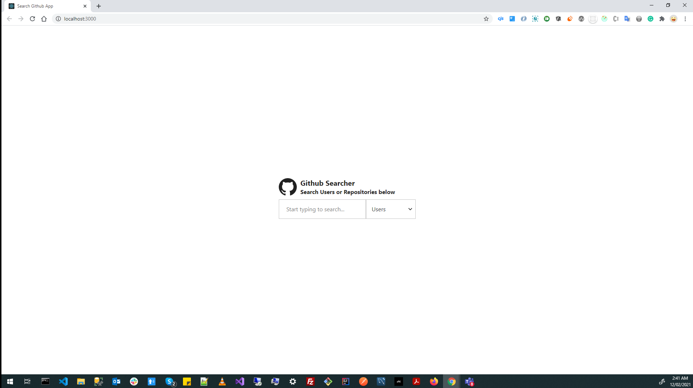
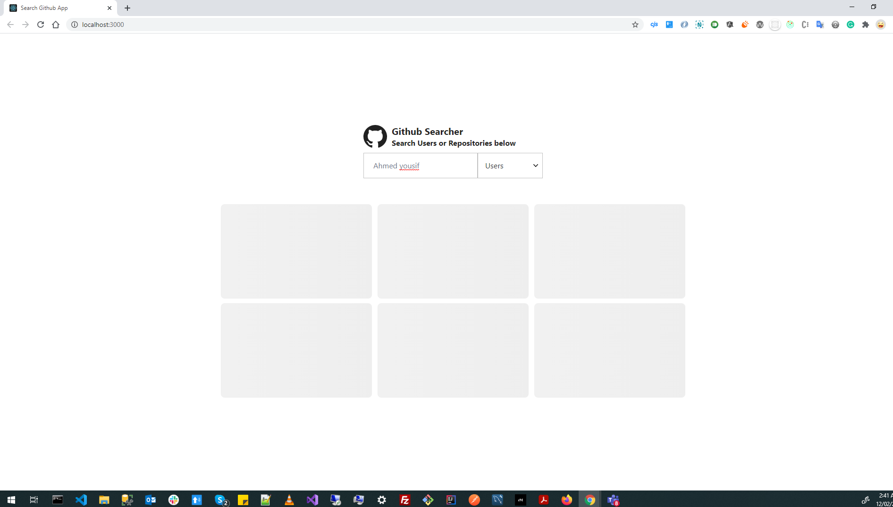
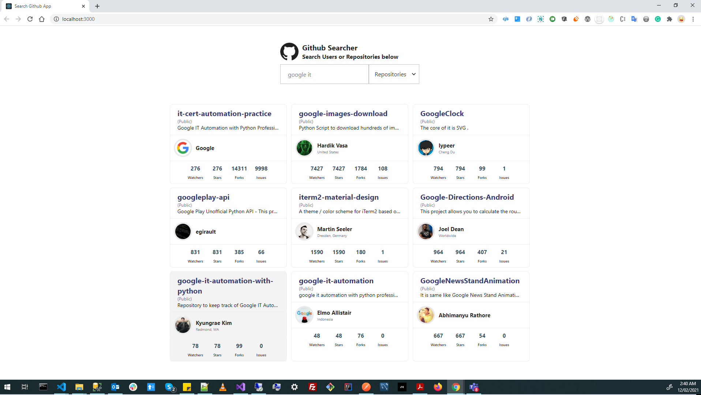
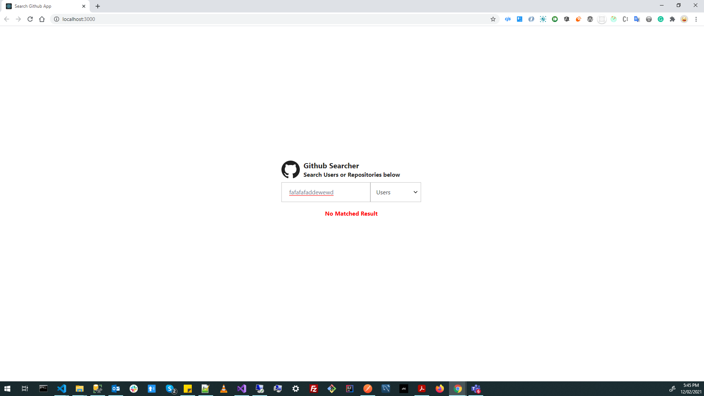
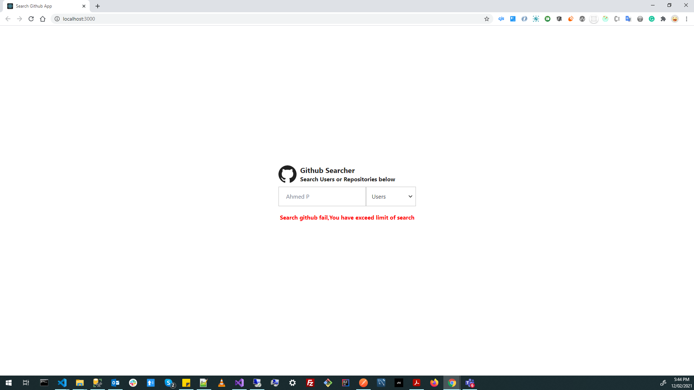

# Github Search

This project is  a GitHub search application 

a single page application built with

- React.js
- TypeScript
- ExpressJs, REDIS
- Redux and redux-persist
- React Router
- Vanilla CSS

## Project Files

- [Backend API](./server)
- [Frontend App](./app)

## Snapshots

### Backend API:

### Frontend App:

