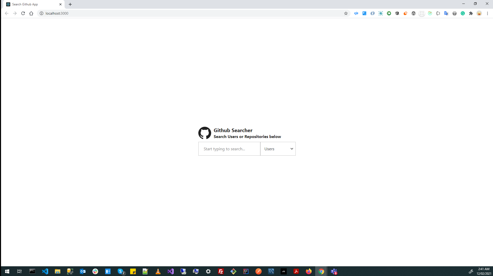
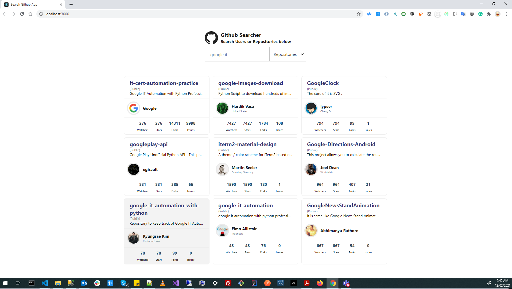
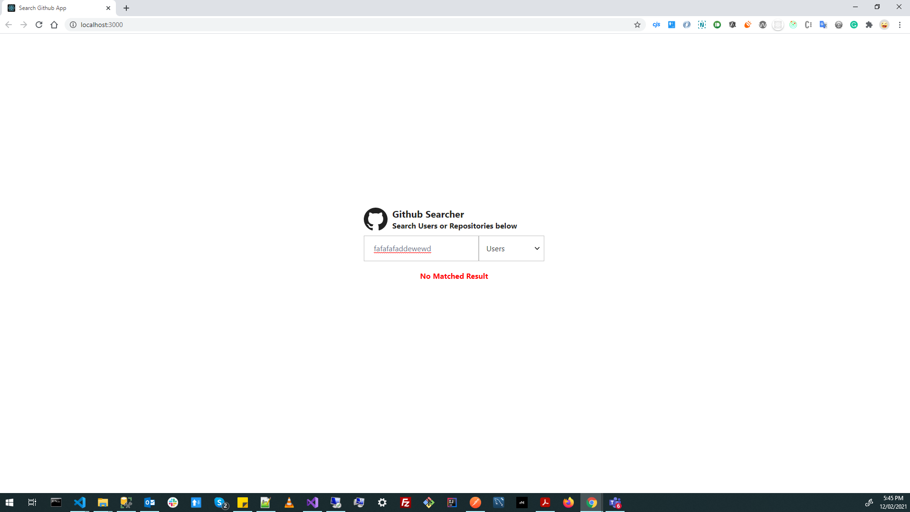

# Search Github App Project

## Assumptions
* Since GitHub API has a request rate limit, so the user will be able to make about **9 new searches per minute**.

* After user exceeds the limit he'll get error message for new search.

* Since we have a limited rate of requests so we will assume that this server serves **only 1 client** so we can use one instance of the app.

## Requirements
For development, you should have Node.js and NPM, installed in your environment.

## How to build and run this project
* All configurations located in config.ts that can be linked to .env file.
* Set your configurations in **config.ts** file.
* Execute `npm install` to install node modules.
* Execute `npm start` and You will be able to access the App from http://localhost:3000
* *If having any issue* then make sure 3000 port is not occupied else provide a different port in **config.ts** file.

## Architecture

* component folder represents component parts of the application such as search-bar and search-result.
* pages folder represents route handler and pages, that responsible for handling routes.
* docs folder represents the documentation folder.
* redux folder represents the state manager using redux, that responsible for fetching and persisting data in the app.
* shared folder represents the shared parts between server and client, that can be packaged as a node package.
* utils folder represents the utilities and helpers across the app.
```
    │   app.tsx
    │   config.ts
    ├─── component
    ├─── pages
    ├─── docs
    ├─── redux
    ├─── shared
    └─── utils
```

Search Github app project consist of one page has the following states
### 1- Inital State (landing state).

<p align="center">
    
</p>
<br>

### 2- Loading State : while loading data from api

<p align="center">
    
</p>

<br>

### 3- User Result State : results of user search

<p align="center">
    
</p>


### 4- Repository Result State : results of repo search

<p align="center">
    
</p>


### 5- No Result State : no results of search

<p align="center">
    
</p>


### 6- Error State : search error

<p align="center">
    
</p>