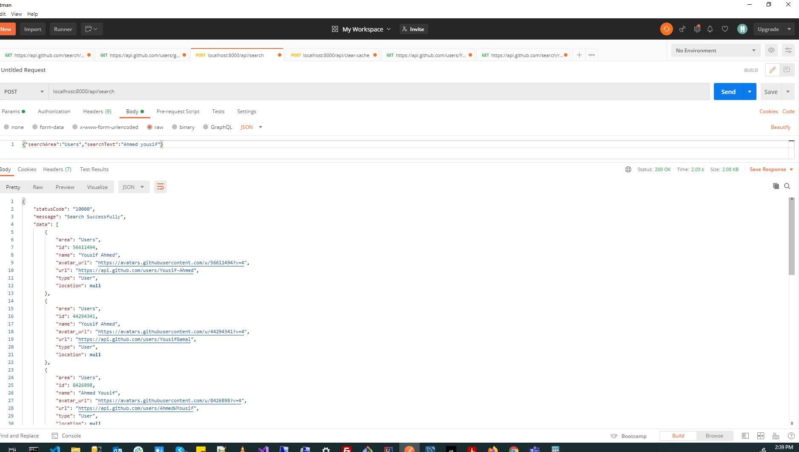
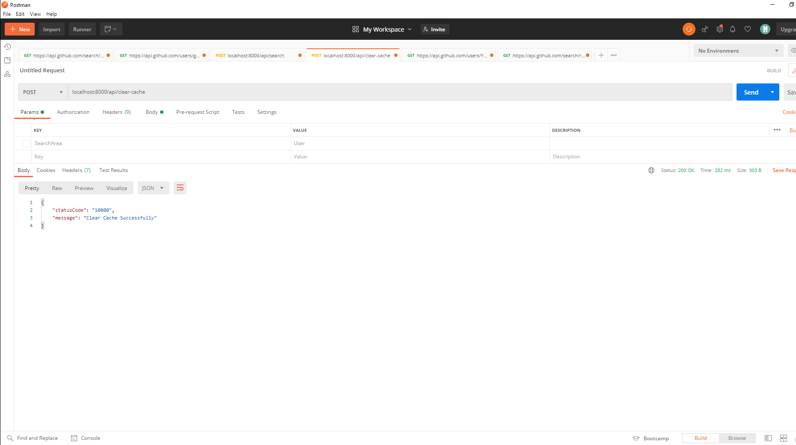
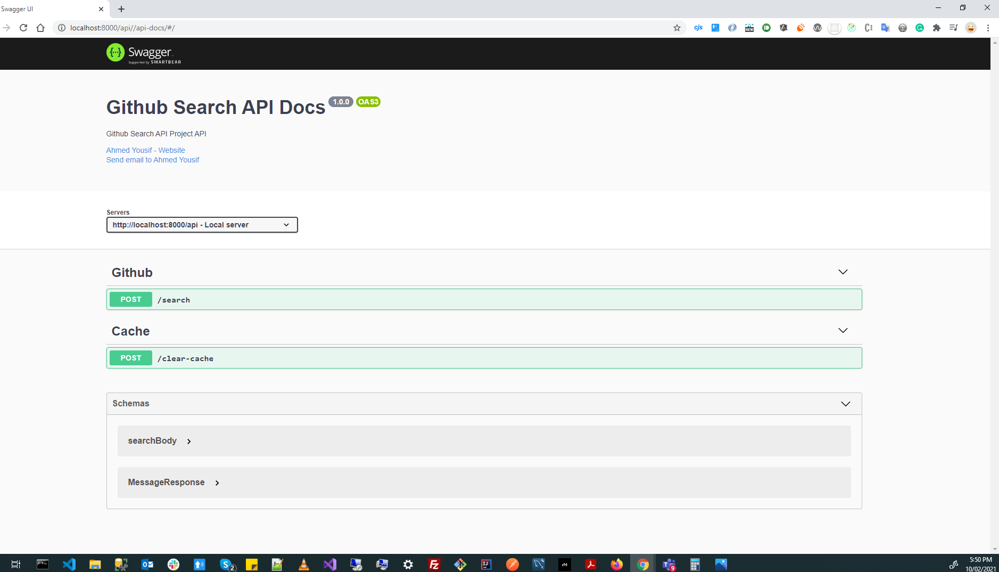

# Search Github Backend Project

## Assumptions
* Since GitHub API has a request rate limit, so we will use **authenticated requests** to get the maximum rate possible.

* Since Github search API has a limit of **30 r/m** and user detail API has a limit of **83 r/m**, So if we make the limit of the search results 9 items the user will be able to make about **9 new searches per minute**.

* Since we have a limited rate of requests so we will assume that this server serves **only 1 client**.

## Requirements
For development, you should have Redis server, Node.js and NPM, installed in your environment.

## How to build and run this project
* Install Redis on your local.
* Make a copy of **.env.example** file to **.env**.
* Set your configurations in **.env** file.
* Execute `npm install` to install node modules.
* Execute `npm start` and You will be able to access the API from http://localhost:8000
* *If having any issue* then make sure 8000 port is not occupied else provide a different port in **.env** file.

## Architecture

* core folder represents core parts of the application such as APIRespnses and APIErrors.
* routes folder represents route handler, that responsible for handling routes by validating its data then pass it to the controller to handle the request.
* controller folder represents the business logic layer, that responsible for handling requests by applying business rules.
* services folder represents the data access layer, that responsible for fetching and persisting data in the app.
* shared folder represents the shared parts between server and client, that can be packaged as a node package.
* utils folder represents the utilities and helpers across the app.
```
    │   app.ts
    │   config.ts
    │   server.ts
    ├─── controllers
    ├─── core
    ├─── docs
    ├─── routes
    ├─── services
    ├─── shared
    └─── utils
```

Search Github Backend project consist of 
### 1- "Search" API endpoint which eventually collect the data from Github & stores it in REDIS.

<p align="center">
    
</p>
<br>

### 2- "clear-cache" : Clear Backend Caching

<p align="center">
    
</p>

<br>

### 3- "api-docs" : API Documentation

<p align="center">
    
</p>
